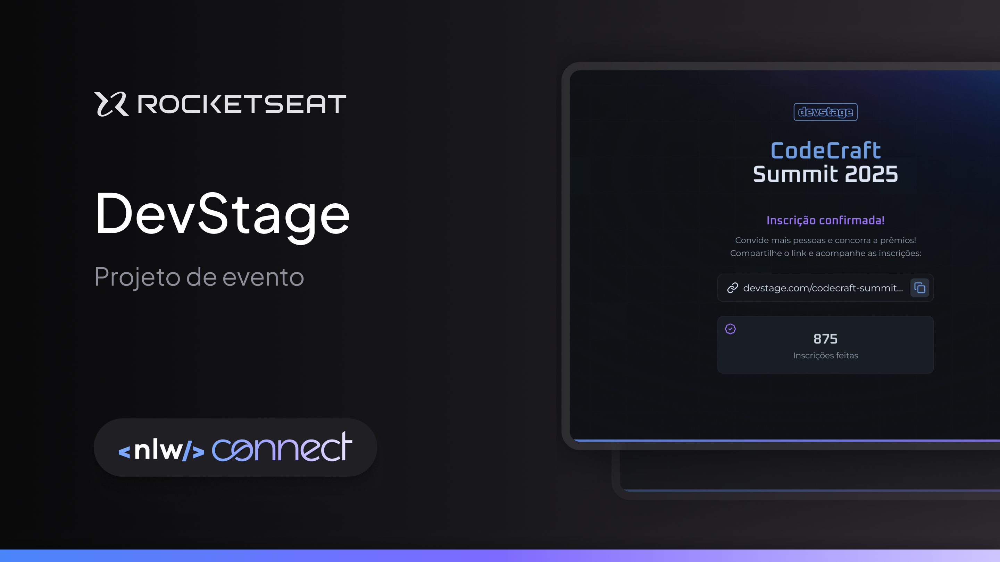

# NLW#19 Connect - Full-Stack - CodeCraft Summit 2025

## Sobre o Projeto 📝
O projeto "NLW#19 Connect" foi construído durante o evento NLW#19 da Rocketseat, focado no desenvolvimento de uma aplicação full-stack.
O objetivo do projeto é criar uma plataforma para inscrição em um evento, com recursos de compartilhamento de links de inscrição e acompanhamento de inscrições realizadas.

  

## Funcionalidades 📋
- Cadastro de usuários
- Geração de link único de convite para cada usuário
- Estatísticas de inscrições realizadas

## Tecnologias Utilizadas ✅
### HTML 📚
- Hypertext
- Markup
  - tags
  - atributes
- Language
### CSS 📚
- Cascading
- Style
- Sheet
### JavaScript 📚
- Linguagem Interpretada pelo Browser
- Multiparadigmas

## Conceitos fundamentais de programação 📖
Comentários
Declaração de variáveis (const, let)
Operadores (atribuição, concatenação, matemáticos)
Tipos de dados (string, number, boolean, Date, Math)
Estrutura de dados (functions, object, array)
Controle de fluxo (if/else)
Estrutura de repetição (for)
Manipulação e gestão dos dados
Conversão de dados

## Algoritmo 📖
Sequência de passos lógica e finita para resolução de um problema

## Fases da resolução de um problema 📖
Coletar os dados
Processar os dados
Apresentar os dados

## Plataforma de Ensino 🚀
Este projeto faz parte da trilha de aprendizado da **[Rocketseat](https://www.rocketseat.com.br)**.

## Autor ✍️
Projeto replicado como parte dos ensinamentos da Rocketseat, com ajustes realizados por **William Milanez**.
